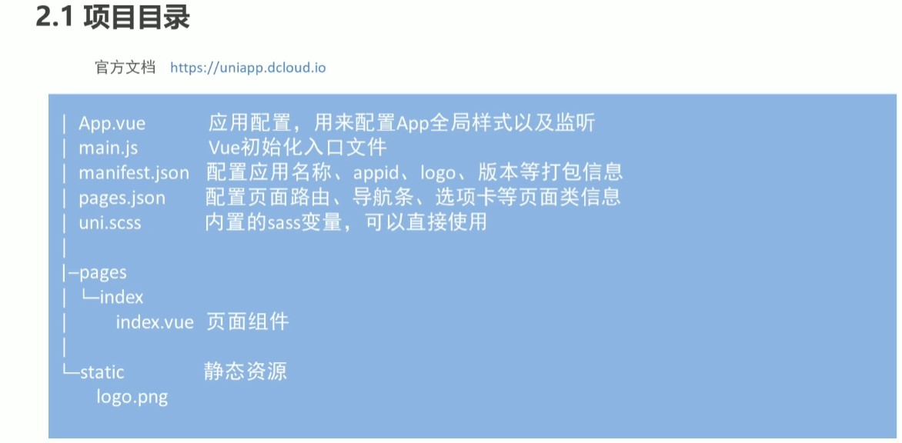
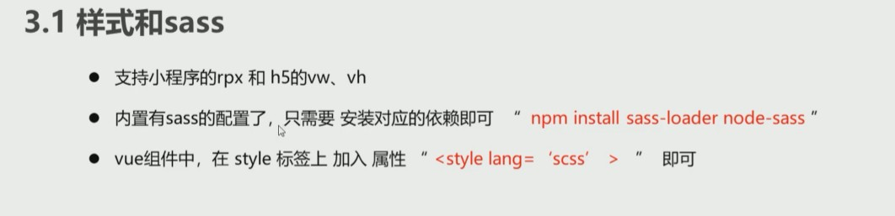

# 1 uni-app学习

## 1.1 什么是uni-app

> uni-app是一个使用Vue.js语法来开发所有前端应用的框架（也称之为全端开发框架）
>  技术栈：JavaScript，vue， 微信小程序， uni-app

## 1.2 有哪些uni-app的作品


线上项目.png

## 1.3. uni-app的社区规模


社区规模.png

# 2 uni-app基础

## 2.1 如何创建项目


```css
脚手架搭建项目
1.全局安装  
    npm install -g @vue/cli  
2.创建项目      
    vue create -p dcloudio/uni-preset-vue my-project     
3.启动项目（微信小程序）   
    npm run dev:mp-weixin    
4.微信小程序开发者工具导入项目         
```

（搭建过程中可能会遇到的问题）


脚手架搭建版本不一致.png

## 2.2 如何编写代码

## 2.3 uni-app初体验


初始界面.png

## 2.4 项目结构介绍


项目目录.png

## 2.5 样式和sass

- 支持小程序的rpx 和 h5的vw，vh。
   `rpx 小程序中的单位 750rpx = 屏幕宽度 vw h5单位 100vw = 屏幕的宽度， 100vh = 屏幕的高度`
- 内置sass的配置， 只需要安装对应的依赖即可  `npm install sass-loader node-sass`
- vue组件中，在style标签上加入属性`<style lang= 'scss'>`即可

## 2.6 基本语法

学过vue的同学应该很容易上手,大胆去尝试吧


```xml
<template>
    <view class="content">
        <view>{{dataObj.name}}</view>
        <view>{{dataObj.age}}</view>
        <view>{{dataObj.boolean}}</view>
        <view>
            <view v-for="item in filterList" :key= 'item.id'>{{item.text}}</view>
        </view>
    </view>
    
</template>
<script>
    export default {
        data() {
            return {
                dataObj: {
                    name: 'Davidsofter',
                    age: 23,
                    boolean: true,
                },
                fruitList: [{id: 0, text: '🍎'},{id: 1, text: '🍌'},{id: 2, text: '🍇'}]
            }
        },
        computed: {
            filterList() {
                return this.fruitList.filter(v => v.id<=0)
            }
        }
    }
</script> 
```


基本语法显示.png

## 2.7 事件

添加点击事件，自定义参数和传参


```xml
<template>
    <view class="content">
        <view>
            <button data-item="123" @click="btclick(1,$event)">点击我试试</button>
        </view>
    </view>
    
</template>

<script>
    export default {
        data() {
            return {
            }
        },
        methods: {
            btclick(data,event) {
                console.log("我不想努力了😘")
                console.log(data)
                console.log(event)
            }
        },
    }
</script>
```

查看打印出的结果：


点击事件.png

## 2.8 组件

### 1 组件的定义/引入/注册/使用

> 重点章节，组件化思想是前端必备思想之一，灵活的使用组件可以提高网页开发效率，提高代码复用率，降低块与块之间的耦合性。

#### 1.1 组件的定义

- 在src目录下新建文件夹components用来存放组件
- 在components目录下直接新建vue文件

#### 1.2 组件的引入

- 在页面中引入组件 "import 组件名 from '组件路径'"

#### 1.3 组件的注册

- 在页面的实例中，新增属性 components
- 属性components是一个对象， 在里面添加要注册的组件

#### 1.4 组件的使用

+在页面的template中添加组件标签 "<组件><组件/>"

#### 1.5 全局数据传递

- 通过prototype在vue的原型上添加属性


全局数据传递.png

- 在App.vue文件中向外暴露一个全局对象

  

  globalData数据传递.png

- 以上两种方法的拿值


拿全局数据方法.png

#### 1.6 使用插槽实现动态更新组件


插槽.png

## 2.9 生命周期

#### 1 介绍

- uni-app框架的生命周期结合了vue和微信小程序的生命周期
- 全局APP中使用 onLaunch 表示应用启动时
- 页面中使用 onLoad 或者 onShow 分别表示页面加载完成 和 页面显示时
- 组件中使用mounted 表示组件挂载完毕时

#### 2 完整生命周期

- [uni-app生命周期](https://links.jianshu.com/go?to=https%3A%2F%2Funiapp.dcloud.io%2Fframe%3Fid%3D%E7%94%9F%E5%91%BD%E5%91%A8%E6%9C%9F)
- [vue生命周期图示](https://links.jianshu.com/go?to=https%3A%2F%2Fcn.vuejs.org%2Fv2%2Fguide%2Finstance.html%23%E7%94%9F%E5%91%BD%E5%91%A8%E6%9C%9F%E5%9B%BE%E7%A4%BA)
- [微信小程序生命周期](https://links.jianshu.com/go?to=https%3A%2F%2Fdevelopers.weixin.qq.com%2Fminiprogram%2Fdev%2Fframework%2Fapp-service%2Fpage-life-cycle.html)

# 3.uni-app项目

- 懂你找图

> 本文结合黑马程序员教学视频，部分截图来自原视频
>  黑马视频链接： [https://www.bilibili.com/video/BV1Sc41187nZ?p=1](https://links.jianshu.com/go?to=https%3A%2F%2Fwww.bilibili.com%2Fvideo%2FBV1Sc41187nZ%3Fp%3D1)

> 作者：VinSmokeW
> 链接：https://www.jianshu.com/p/3dec2cc2e30b
> 来源：简书
> 著作权归作者所有。商业转载请联系作者获得授权，非商业转载请注明出处。

#### 1.脚手架搭建项目

```js
//1. 全局安装
npm install -g @vue/cli
//2. 创建项目
vue create -p dcloudio/uni-preset-vue my-project
//3. 启动项目（微信小程序）
npm run dev:mp-weixin
//4. 微信小程序开发者工具导入项目
```

#### 2.项目目录



##### 2.1.样式和sass



```js
npm i sass-loader@4.13.0 node-sass@8.0.2
```

##### 2.2.uni-ui和接口使用

> unu-ui :https://www.npmjs.com/package/@dcloudio/uni-ui
>
> 接口文档：https://www.showdoc.com.cn/414855720281749?page_id=3678621017219602
>
> 比如 http://157.122.54.189:9088/image/v3/homepage/vertical 这个接口不能用，带上参数之后
> http://157.122.54.189:9088/image/v3/homepage/vertical?limit=10&order=hot&skip=2
> 就可以用了

index.vue

```js
<template>
  <view>首页
    <text class="iconfont iconvideocamera"></text>
    <uni-badge text="1"></uni-badge><uni-badge text="2" type="success" ></uni-badge>
    <uni-badge text="3" type="primary" :inverted="true"></uni-badge>

  </view>
</template>

<script>
import {uniBadge} from '@dcloudio/uni-ui'
export default {
  name: "index",
  components:{
    uniBadge
  },
  onload(){
    // http://157.122.54.189:9088/image/v3/homepage/vertical
    // 1.原生的微信小程序的api
    wx.request({
      url:"http://157.122.54.189:9088/image/v3/homepage/vertical?limit=10&order=hot&skip=2",
      success(res){
        console.log(res);
      }
    })

    // 2. uni-api
    uni.request({
      uni:"http://157.122.54.189:9088/image/v3/homepage/vertical?limit=10&order=hot&skip=2"
    }).then(res => {
      console.log(res);
    })
  }
}
</script>

<style scoped>

</style>
```


##### 2.2. 首页模块

- 功能分析
  - 修改导航栏的外观
  - 使用分段器组件搭建子页面
  - 封装自己异步请求
  
- 搭建子页面
  - 首页模块分为4个部分,分别是推荐、分类、最新、专辑
  - 新建自定义组件来代替上述的4个页面
    - home-recommend
    - home-category
    - home-new
    - home-album
  - 分段器介绍
    - 分段器指的是uni-ui中的一个组件,其实就是我们俗称的标签页,tab栏
    - https://ext.dcloud.net.cn/plugin?id=54
  
- 封装自己的异步请求
  - 封装的原因
    - 原生的请求不支持 promise
    - unl-apl的请求不能够方便的添加请求中效果
    - uni-api的请求返回值是个数组,不方便
  - 封装的思路
    - 基于原生的 promise来封装
    - 挂载到vue的原型上
    - 通过 this request的方式来使用

  

  ##### 2.3.首页模块-推荐模块

  - 接口文档
    https://www.showdoc.com.cn/414855720281749?page_id=3678621017219602

  - 数据动态渲染
  - moment. Js的使用
  - “热门”列表的基于 scroll-view的分页加载

- 页面

##### 2.4.首页模块-专辑模块

- 专辑列表
- 专辑详情

1.专辑列表

1.1功能分析

- 使用 setNavigation BarTitle修改页面标题
- 发送请求获取数据
- 使用 swiper轮播图组件
- 使用 scroll-view组件实现分页
- 点击跳转到专辑详情页

